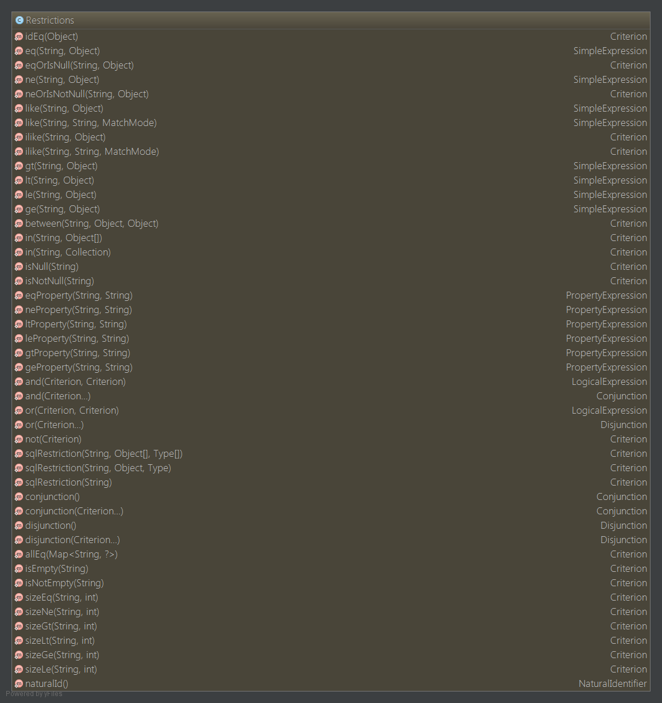
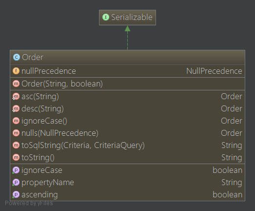
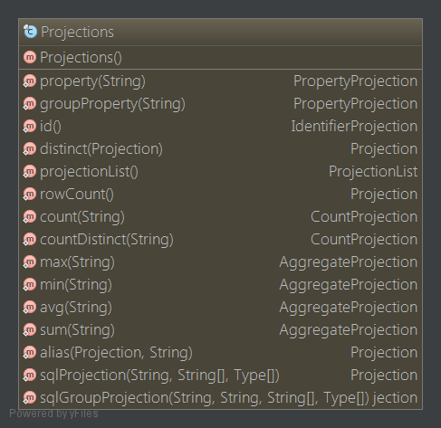

####Hibernate Criteria 查询

Hibernate提供了多种操作对象的方式。其中一个方法就是Criteria API，它允许你通过编程的方式创建一个criteria查询对象，然后使用各种过滤规则和逻辑条件。

Hibernate中的<code>Session</code>接口提供了<code>createCriteria()</code>方法来创建一个<code>Criteria</code>对象，当我们执行一个criteria查询的时候，它将会返回一个持久化类的实例。

#####在Criteria查询中使用限制条件

    Crteria cr = session.createCriteria(Employee.class);
    cr.add(Restrictions.eq("salary", 2000));
    List results = cr.list();

#####排序

    Criteria cr = session.createCriteria(Employee.class);
    //工资大于2000的
    cr.add(Restrictions.gt("salary", 2000));
    //按工资由小到大排序
    cr.addOrder(Order.desc("salary"));
    //获取
    List results = cr.list();

#####投影和聚合

    Criteria cr = session.createCriteria(Employee.class);
    //To get total row count
    cr.setProjection(Projections.rowCount());

