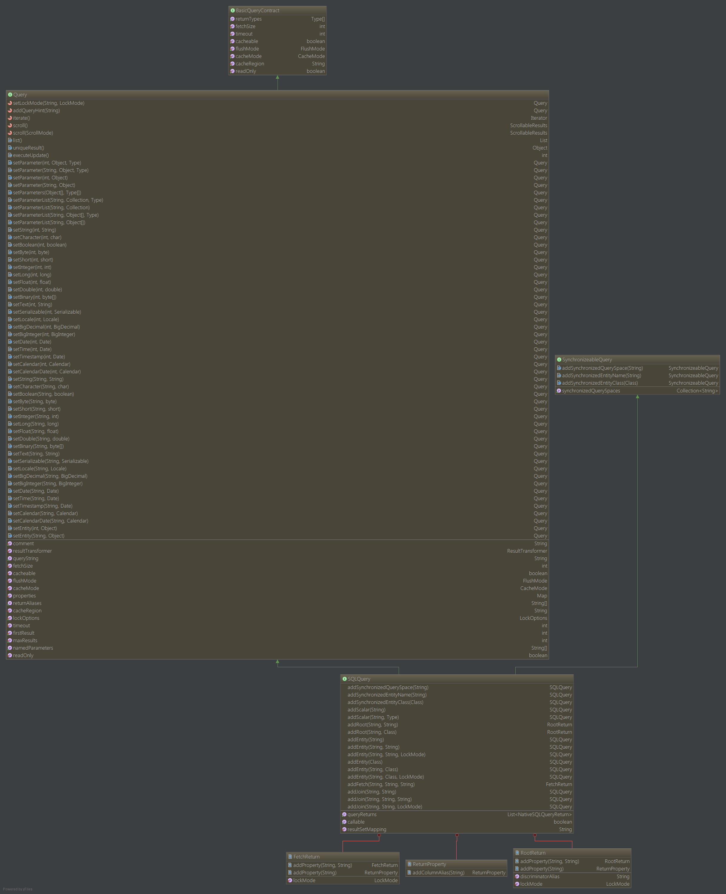

####Hibernate原生SQL

Hibernate支持使用原生SQL，来支持特定于某个数据库的特性。
我们可以通过

    SQLQuery query = session.createSQLQuery();

获得一个SQLQuery对象来执行原生SQL语句。

#####Scalar queries

    String sql = "SELECT first_name, salary FROM EMPLOYEE";
    SQLQuery query = session.createSQLQuery(sql);
    query.setResultTransformer(Criteria.ALIAS_TO_ENTITY_MAP);
    List result = query.list();

#####Entity queries

    String sql = "SELECT * FROM EMPLOYEE";
    SQLQuery query = session.createSQLQuery();
    query.addEntity(Employee.class);
    List results = query.list();

#####Named SQL queries

    String sql = "SELECT * FROM EMPLOYEE WHERE id = :employee_id";
    SQLQuery query = session.createSQLQuery(sql);
    query.addEntity("employee_id", 10);
    query.setParameter("employee_id", 10);
    List results = query.list();

