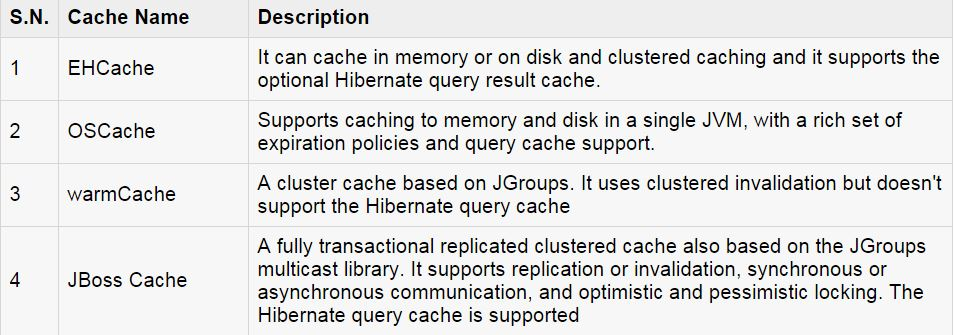
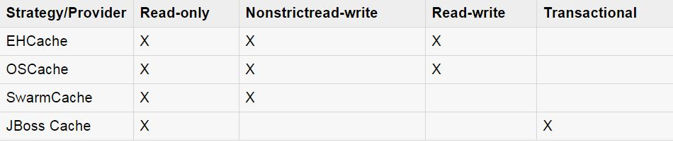

####Hibernate缓存
缓存是系统优化时都会考虑的一个点。在Hibernate中提供了多级缓存模型。

#####一级缓存
一级缓存是Session缓存，所有的请求都必须经过这个缓存。
如果你对一个对象执行多个更新，Hibernate会尽肯能长的延迟更新从而减少更新语句被执行的次数。如果你关闭了Session，所有被缓存的对象都会被丢失。

#####二级缓存
二级缓存是可选的缓存，当我们需要从二级缓存中查找一个对象的时候总是会现在一级缓存中取查找。我们可以为每一类和每一个集合配置二级缓存，它主要用于跨Session缓存对象。

在Hibernate中可以使用任何第三方缓存。Hibernate中提供了一个<code>org.hibernate.cache.CacheProvider</code>接口，它提供了具体的缓存实现。

#####查询缓存
Hibernate也为查询结构提供了一个缓存，它和二级缓存集成在一起。
这也是一个可选的特性，需要二块二外的物理缓存区域，一块用于缓存查询结果，一块用于缓存一张表最后被更新的时间戳。这个缓存仅对查询有用。

#####第二级缓存
Hibernate默认使用一级缓存，你不需要显式的去配置。并不是所有的类都能够从二级缓存中受益，所以能够关闭二级缓存就很重要。

设置二建缓存需要两步。首先，你必须选择使用哪种并发策略。然后，你需要使用缓存提供其去配置缓存过期时间和一些物理缓存属性。

#####并发策略
一个并发策略是一个往缓存中放入数据项和从缓存中取出数据项的中间人。如果你准备开启二级缓存，你必须为每一个类和集合指定并发缓存策略。

- **Transactional**
- **Read-Write**
- **Nonstrict-read-write**
- **Read-Only**

    <cache usage="read-write"/>

#####Cache provider

Hibernate强制你为整个系统选择一个缓存提供器。

每一个缓存提供器并不是和每一个并发策略兼容。下面的兼容矩阵可以帮助你选择一个合适的组合。

以EHCache为例：

    <property name="hibernate.cache.provider_class">
	    org.hibernate.cache.EhCacheProvider
	</property>

现在，你需要选择指定缓存区域的属性。EHCache拥有自己的配置文件<code>ehcache.xml</code>，将其置于系统的类路径下。

    <diskStore path="java.io.tmpdir"/>
    <defaultCache
	    maxElementInMemory="10000"
	    etrenal="false"
	    timeToIdleSeconds="120"
	    timeToLiveSeconds="120"
	    overflowToDisk="true"
	/>
	
	<cache name="Employee"
		maxElementsInMemory="500"
		eternal="true"
		timeToIdleSeconds="0"
		timeToLiveSeconds="0"
		overflowToDisk="false"
	/>

到目前为止，我们已经为Employee类开启了二级缓存，无论你什么时候访问Employee或者当你通过标识符载入一个Employee的时候，Hibernate都会去访问二级缓存。

你应该分析你所有的类，并且为每一个类选择合适的缓存策略。有时候，二级缓存可能会降低系统的性能。我们以系统在开启缓存和不开启缓存时的性能为基准，如果缓存并没有改善系统的系统，我想我们没有理由去使用缓存。

#####查询缓存
要使用查询缓存，你必须在配置文件中使用<code>hibernate.cache.use_query_cache="true"</code>属性来激活它。

接下来，

    Session session = SessionFactory.openSession();
    Query query = session.createQuery("FROM EMPLOYEE");
    query.setCacheable(true);
    List users = query.list();
    SessionFactory.closeSession();

Hibernate也可以通过<code>cache region</code>的概念来提供细粒度的缓存支持。一个<code>cache region</code>是缓存的一部分。

    Session session = SessionFactory.openSession();
    Query query = session.createQuery("FROM EMPLOYEE");
    query.setCacheable(true);
    query.setCacheRegion("employee");
    List users = query.list();
    SessionFactory.closeSession();

